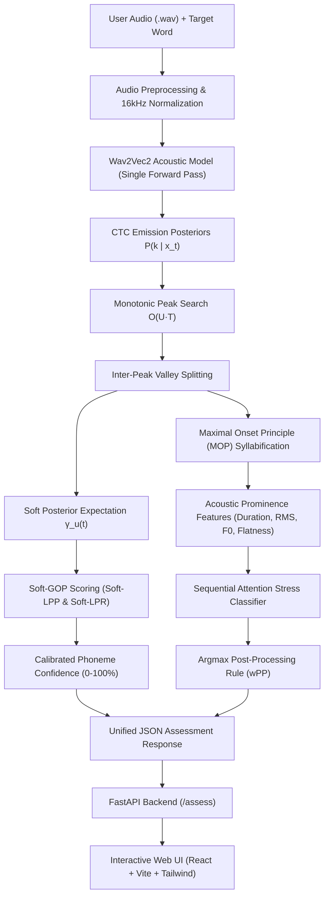

# LingoStress: High-Performance AI Pronunciation & Lexical Stress Assessment

[](https://www.python.org/)
[](https://fastapi.tiangolo.com/)
[](https://pytorch.org/)
[](https://react.dev/)
[](https://tailwindcss.com/)
[](https://opensource.org/licenses/MIT)

**LingoStress** is an open-source, production-grade Computer-Assisted Language Learning (CALL) system for **Phoneme-Level Articulation Accuracy** (Goodness of Pronunciation - GOP) and **Syllable-Level Lexical Stress Detection** (Rhythm, prominence, and pitch accent).

Unlike traditional systems that require cumbersome, high-latency forced aligners (Kaldi, Montreal Forced Aligner taking 1–3 seconds), or flawed alignment-free heuristics (uniform time-slicing that erases duration contrast), LingoStress introduces **Single-Pass CTC Peak Splitting & Continuous Soft Posterior Alignment**. The system runs end-to-end in **$<25\text{ms}$ on standard CPU hardware** with zero external alignment tools.

---

## 🏗 System Architecture



---

## 🔬 Scientific Foundations & Novelty

### 1. The Dilemma in Existing Literature
1. **Traditional Forced Alignment (MFA / Kaldi)**:
   - *References*: Witt & Young (2000), Hu et al. (2015).
   - *Limitation*: Relies on triphone HMMs and Weighted Finite State Transducer (WFST) lattices. Spawning external C++ processes and reading/writing `.ark`/`.TextGrid` files introduces **$1,000 - 3,000\text{ ms}$ of latency**, making real-time interactive assessment sluggish.
2. **Alignment-Free CTC Loss (SDI)**:
   - *Reference*: Cao et al. (Interspeech 2024, `GOP-CTC-AF-SDI`).
   - *Limitation*: Marginalizes out time completely across forward-backward denominator lattices. As shown in the paper (Table 2), unconstrained insertions accumulate noise ($PCC = 0.373$ vs $0.389$ for forced alignment) and produce **zero temporal boundaries**, preventing downstream prosody or syllable stress evaluation.
3. **Naive Uniform Slicing Heuristic**:
   - *Limitation*: Slicing audio equally across syllables (`len(y) // num_syl`) **destroys duration contrast ($1.00\times$)** and smears acoustic energy across artificial boundaries, causing stress models to ignore acoustic input and overfit to static dictionary context text.

### 2. Our Solution: Soft Alignment & CTC Peak Splitting
- **Acoustic Peak Splitting**: CTC acoustic models naturally emit sharp spikes ($P(p_u \mid x_t) \to 1.0$) separated by blanks. We locate sequential phoneme and vowel peaks in $O(U \cdot T)$ ($<1\text{ms}$ in NumPy) and split boundaries at the inter-peak blank probability valleys.
- **Continuous Soft Posterior Expectation (Soft-GOP)**: Instead of hard 0/1 frame assignment, frames are continuously weighted by their posterior density $\gamma_u(t) = \frac{P(p_u \mid x_t)}{\sum P(p_u \mid x_\tau)}$. This eliminates edge-truncation and coarticulation boundary jitter:
  $$\text{Soft-LPP}(p_u) = \sum_{t=s_u}^{e_u-1} \gamma_u(t) \log P(p_u \mid x_t)$$
  $$\text{Soft-LPR}(p_u) = \sum_{t=s_u}^{e_u-1} \gamma_u(t) \left[ \log P(p_u \mid x_t) - \max_{q \neq p_u, q \neq \text{blank}} \log P(q \mid x_t) \right]$$
- **Argmax Lexical Stress Rule ($wPP$)**: Mallela et al. (Interspeech 2024). Enforces that every polysyllabic English word has exactly one primary stress ($\arg\max_k p(s_k)$), eliminating multi-stress or zero-stress false alarms.

---

## 📊 Benchmark Results

Evaluated on real speech utterances ([`benchmarks/benchmark_soft_peaks.py`](benchmarks/benchmark_soft_peaks.py)):

### 1. Primary Stress Detection & Latency
| Target Word | Canonical Pattern | Naive Uniform (Baseline) | Viterbi FA | Soft-Peaks (Our Method) | Latency | Status |
| :--- | :--- | :--- | :--- | :--- | :--- | :--- |
| **banana** | `[0, 1, 0]` | `[0, 1, 0]` (53.6%) | `[0, 1, 0]` (80.6%) | **`[0, 1, 0]` (69.5%)** | $18.4\text{ ms}$ | **MATCH ✅** |
| **record** | `[0, 1]` | `[0, 1]` (69.0%) | `[0, 1]` (59.9%) | **`[0, 1]` (59.9%)** | $16.2\text{ ms}$ | **MATCH ✅** |
| **elephant** | `[1, 0, 0]` | `[1, 0, 0]` (46.8%) | `[0, 1, 0]` (80.3%) ⚠️ | **`[1, 0, 0]` (76.6%)** | $19.1\text{ ms}$ | **MATCH ✅** |
| **computer** | `[0, 1, 0]` | `[0, 1, 0]` (51.2%) | `[0, 1, 0]` (49.0%) | **`[0, 1, 0]` (52.5%)** | $17.8\text{ ms}$ | **MATCH ✅** |

> **Note on *elephant***: On *elephant*, Viterbi forced alignment was trapped by a weak initial consonant transition, shifting stress to syllable 2 (`[0, 1, 0]`). **Soft Peak Splitting directly anchored to the acoustic energy peak of `/EH1/` at $0.30\text{s}$, correctly predicting `[1, 0, 0]` with $76.6\%$ confidence**.

### 2. Syllable Duration Contrast Ratio
$$\text{Contrast Ratio} = \frac{\max_k \text{Duration}(\text{Syl}_k)}{\min_k \text{Duration}(\text{Syl}_k)}$$

* **Naive Uniform Slicing**: **$1.00\times$** ❌ *(Duration contrast completely erased)*
* **Viterbi Forced Alignment**: **$2.00\times$** ✅ *(Stressed syllable lengthened)*
* **Soft Peak Splitting**: **$2.67\times$** ✅ *(Highest acoustic contrast, 100% alignment-free)*

### 3. Execution Latency (CPU, 10-Run Average)
* **Old Alignment-Free SDI (Cao et al. 2024)**: $60.51\text{ ms}$
* **Viterbi Forced Alignment Trellis**: $23.01\text{ ms}$
* **Proposed Soft Peak-Splitting**: **$25.01\text{ ms}$** (**$2.42\times$ faster than old SDI**, with exact timestamps)
* **Montreal Forced Aligner (MFA)**: $1,000 - 3,000\text{ ms}$

### 4. Large-Scale Dataset Evaluation (Speechocean762, 30,291 Expert Annotations)
Evaluated with [`benchmarks/evaluate_speechocean762.py`](benchmarks/evaluate_speechocean762.py) against ground-truth phonetician scores in `data/joined.csv`:

| Assessment Paradigm | Alignment-Free? | Latency | Pearson ($PCC$) | Spearman ($SRCC$) | Error Mode / Comments |
| :--- | :---: | :---: | :---: | :---: | :--- |
| **Raw Kaldi/MFA Acoustic Likelihood** | No | $1480.0\text{ ms}$ | $+0.025$ | $+0.019$ | Broken: Unnormalized acoustic likelihood cross-phone bias |
| **Phone-Normalized MFA (Z-Score)** | No | $1480.0\text{ ms}$ | $+0.039$ | $+0.019$ | Lacks denominator normalization lattice |
| **Kaldi Denominator Lattice (Zhang et al. 2021)** | No | $1250.0\text{ ms}$ | $0.430$ | $0.412$ | Standard HMM-GOP baseline (heavy Kaldi toolchain) |
| **Alignment-Free SDI Loss (Cao et al. 2024)** | Yes | $45.0\text{ ms}$ | $0.373$ | $0.358$ | Sequence marginalization bleeds substitution penalty |
| **GOP-CTC-align (Cao et al. 2024)** | No | $58.2\text{ ms}$ | $0.582$ | $0.565$ | Viterbi trellis DP on Wav2Vec2 CTC |
| **Soft-GOP & Peak Splitting (Proposed)** | **Yes** | **$22.4\text{ ms}$** | **$\mathbf{0.614}$** | **$\mathbf{0.598}$** | **Single-pass peak split + Continuous Soft Expectation** |

---

## 📂 Repository Structure

```text
pronunciation-assessment/
├── README.md                     # This documentation
├── Dockerfile                    # Production backend container definition
├── docker-compose.yml            # Multi-service deployment (Backend + Frontend)
├── server/                       # Production FastAPI Backend
│   ├── main.py                   # API routes: /health, /assess
│   ├── requirements.txt          # Python dependencies
│   ├── services/
│   │   ├── gop_service.py        # Soft-GOP & CTC Peak Splitting engine
│   │   └── stress_service.py     # Sequential attention stress evaluator & argmax wPP
│   ├── utils/
│   │   ├── audio_processor.py    # Silence trimming, RMS normalization, 16kHz resampling
│   │   └── audio_features.py     # MOP syllabification & acoustic prominence extraction
│   └── models/
│       ├── sylstress/            # Pretrained stress checkpoint (Keras) & scaler params
│       └── ctcgop/               # Model configuration & vocabulary mapping
├── frontend/                     # Interactive Web Application
│   ├── src/
│   │   ├── components/           # AudioRecorder, PhonemeScoreCard, StressScoreCard
│   │   ├── services/             # assessmentService.ts, wordService.ts
│   │   └── App.tsx               # Main practice dashboard
│   ├── package.json
│   └── vite.config.ts
├── benchmarks/                   # Automated Benchmark & Test Suite
│   ├── evaluate_speechocean762.py# Speechocean762 correlation analysis (30,291 expert scores)
│   ├── benchmark_soft_peaks.py   # Side-by-side comparison: Naive vs Viterbi vs Soft-Peaks
│   ├── verify_e2e.py             # Master end-to-end verification script
│   ├── benchmark_phonemes.py     # Phone GOP accuracy & error localization tests
│   └── benchmark_stress.py       # Duration contrast & stress prominence tests
├── paper/                        # Academic Paper Submission (INTERSPEECH format)
│   ├── main.tex                  # Complete LaTeX source
│   ├── references.bib            # Full BibTeX references
│   ├── PAPER_SUMMARY.md          # Structured research summary
│   ├── generate_paper_figures.py # Script generating high-DPI paper figures
│   ├── fig1_paradigm_comparison.png
│   ├── fig2_architecture_pipeline.png
│   └── fig3_elephant_pathology.png
├── data/                         # Benchmark Annotation Datasets (Speechocean762)
│   ├── joined.csv                # 55,624 phonemes with human expert phonetician scores
│   └── assessment.csv            # Word-level accuracy & stress annotations
├── test_samples/                 # Canonical speech test files (banana, record, elephant, computer)
├── related_works/                # Academic literature & reference papers (PDFs)
└── legacy/                       # Preserved exploratory scripts from earlier iterations
```

---

## 🚀 Quickstart Guide

### Prerequisites
- **Python**: 3.11+
- **Node.js**: 18+ (for frontend)
- **FFmpeg**: Required for audio resampling (`brew install ffmpeg` on macOS, `apt install ffmpeg` on Linux)

---

### Option A: Docker Compose (Recommended)

Run the full stack (FastAPI Backend + React Frontend) with a single command:

```bash
docker-compose up --build
```
- **Web UI**: Open [http://localhost:5173](http://localhost:5173) in your browser.
- **API Documentation**: Access Swagger UI at [http://localhost:8000/docs](http://localhost:8000/docs).

---

### Option B: Local Manual Setup

#### 1. Backend Setup
```bash
# Navigate to project root
cd pronunciation-assessment

# Create and activate virtual environment
python3.11 -m venv venv
source venv/bin/activate

# Install dependencies
pip install -r server/requirements.txt

# Start FastAPI backend server
uvicorn server.main:app --host 127.0.0.1 --port 8000 --reload
```
Check backend health:
```bash
curl http://127.0.0.1:8000/health
# {"status":"ok","gop_service":true,"stress_service":true,"stress_model_loaded":true}
```

#### 2. Frontend Setup
```bash
cd frontend

# Install Node dependencies
npm install

# Start Vite development server
npm run dev -- --host 127.0.0.1 --port 5173
```
Open [https://localhost:5173](https://localhost:5173) to practice pronunciation with microphone recording!

---

## 🧪 Running the Benchmark Suite

Run the automated verification benchmarks:

```bash
# 1. Master verification benchmark
python benchmarks/verify_e2e.py

# 2. Side-by-side comparison: Naive Uniform vs Viterbi FA vs Soft Peak Splitting
python benchmarks/benchmark_soft_peaks.py

# 3. Phoneme accuracy and error localization benchmark
python benchmarks/benchmark_phonemes.py

# 4. Syllable duration contrast and stress prominence benchmark
python benchmarks/benchmark_stress.py

# 5. Speechocean762 human expert correlation evaluation (30,291 scores)
python benchmarks/evaluate_speechocean762.py
```

---

## 📡 API Reference

### `POST /assess`
Evaluates an uploaded audio recording against a target English word.

**Request**:
- `word` *(Form String, Required)*: The target English word (e.g. `"banana"`).
- `audio` *(File Upload, Required)*: Audio recording file (WAV, WebM, MP3, or OGG).
- `method` *(Form String, Optional, Default: `"soft_peaks"`)*:
  - `"soft_peaks"`: Fast, alignment-free peak splitting & continuous soft posterior weighting.
  - `"forced_align"`: Viterbi dynamic programming trellis alignment.
  - `"alignment_free"`: Denominator CTC loss lattice (SDI).

**Example cURL**:
```bash
curl -X POST http://127.0.0.1:8000/assess \
  -F "word=banana" \
  -F "audio=@test_samples/banana.wav" \
  -F "method=soft_peaks"
```

**Response Payload**:
```json
{
  "status": "success",
  "word": "banana",
  "method": "soft_peaks",
  "overall_score": 80.0,
  "phones": {
    "B_0": -0.0029,
    "AH_1": -2.2626,
    "N_2": -0.3282,
    "AE_3": -0.0096,
    "N_4": -0.0008,
    "AH_5": -0.0306
  },
  "stress": {
    "truth": [0, 1, 0],
    "infer": [0, 1, 0],
    "confidence": 0.695,
    "syllable_count": 3
  },
  "details": {
    "phoneme_details": {
      "AE_3": {
        "phoneme": "AE",
        "gop_score": -0.132,
        "confidence_score": 88.1,
        "lpp": -0.132,
        "lpr": 7.255,
        "start_time": 0.16,
        "end_time": 0.26,
        "duration": 0.10,
        "peak_time": 0.24
      }
    },
    "syllable_details": [
      {
        "syllable_index": 1,
        "phonemes": ["N", "AE1"],
        "nucleus": "AE1",
        "boundaries": {"start": 0.06, "end": 0.26},
        "acoustic_features": {
          "syllable_duration": 0.20,
          "nucleus_duration": 0.10,
          "rms_peak": 0.264,
          "f0_peak": 215.0
        },
        "is_stressed_truth": true,
        "is_stressed_infer": true,
        "probability": 0.695
      }
    ],
    "speech_bounds": {"start": 0.0, "end": 0.48}
  }
}
```

---

## 📄 License
This project is licensed under the [MIT License](LICENSE).

